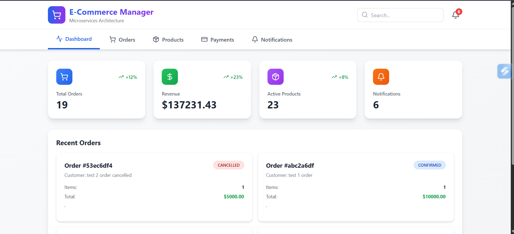
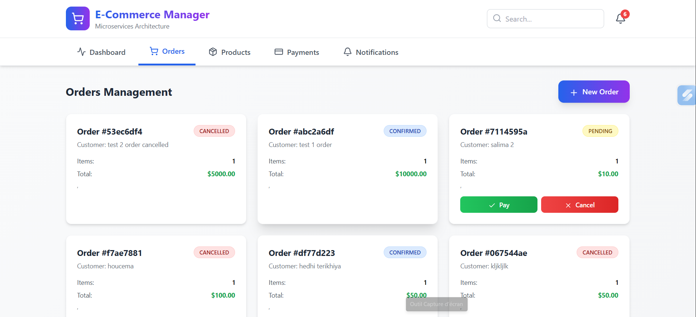
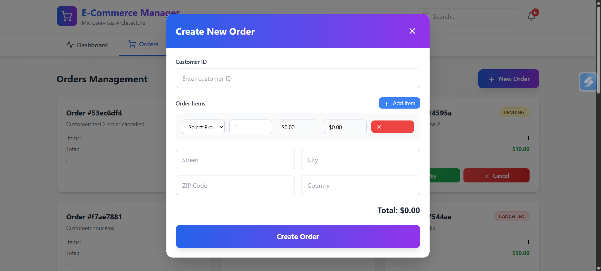
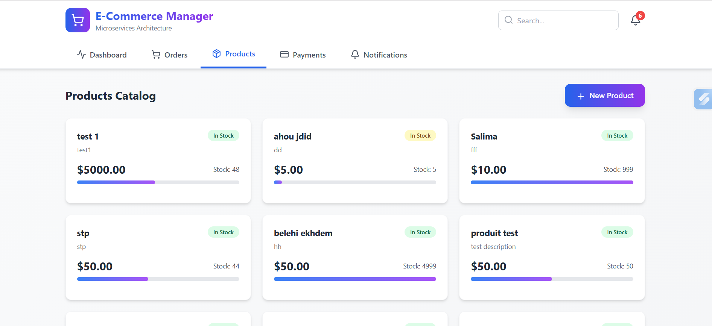
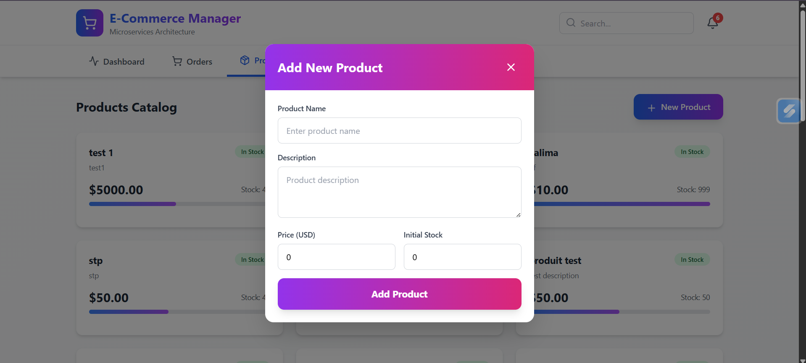
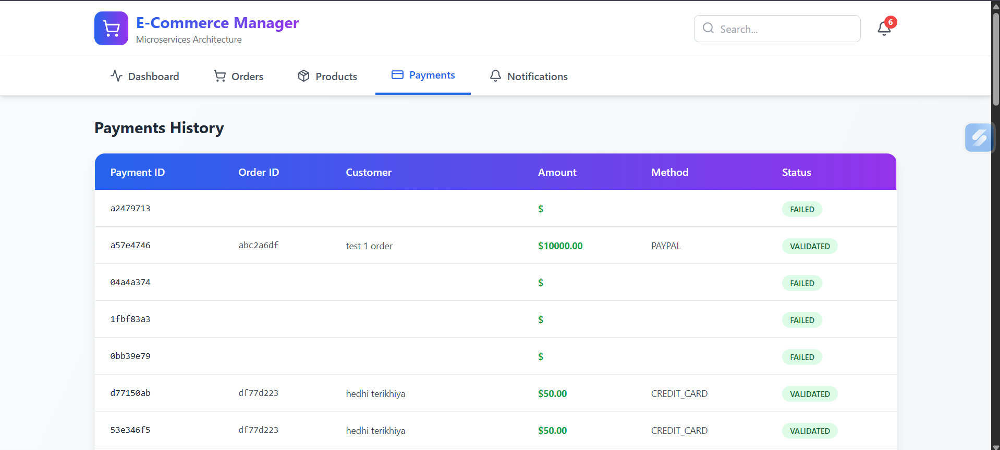
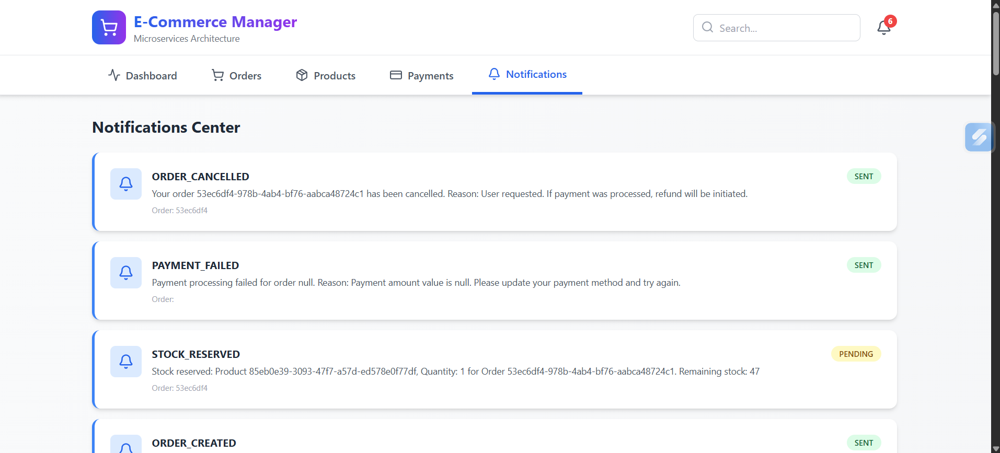

# E-Commerce Event-Driven Platform

## 🎯 Overview

Production-grade microservices architecture implementing **Domain-Driven Design (DDD)**, **CQRS**, and **Event Sourcing** using **Axon Framework**. This platform demonstrates best practices for building scalable, resilient, and maintainable distributed systems.

---

## 🖼️ Screenshots & Visuals

### 📐 Dashboard
Global overview of platform activity and key business metrics.


---

### 📊 Orders List
View and manage customer orders with real-time status updates.


---

### 📝 New Order
Create a new order and trigger the event-driven workflow.


---

### 📦 Products List
Manage product catalog and available stock levels.


---

### ➕ New Product
Add a new product to the catalog and initialize inventory.


---

### 💳 Payments
Track payment processing and transaction states.


---

### 📧 Notifications
Event-driven notifications generated across the system.



### Key Technologies

- **Spring Boot 3.2.0** - Microservices framework
- **Axon Framework 4.9.1** - CQRS & Event Sourcing
- **Spring Cloud 2023.0.0** - Service discovery & API Gateway
- **PostgreSQL 15** - Read model databases (separate per service)
- **Axon Server** - Event store & message routing
- **Docker & Docker Compose** - Containerization
- **Kafka** - Additional event bus (optional)

---

## 🏗️ Architecture

### Bounded Contexts

```
┌─────────────────────────────────────────────────────────────────┐
│                      API Gateway (Port 8080)                    │
│                     Service Discovery (Eureka)                  │
└─────────────────────────────────────────────────────────────────┘
                                │
                ┌───────────────┼───────────────┐
                │               │               │
        ┌───────▼──────┐ ┌─────▼──────┐ ┌─────▼──────┐
        │   ORDERS     │ │  PRODUCTS  │ │  PAYMENTS  │
        │  (Port 8081) │ │(Port 8082) │ │(Port 8083) │
        └──────┬───────┘ └─────┬──────┘ └─────┬──────┘
               │               │               │
               └───────────────┼───────────────┘
                               │
                        ┌──────▼────────┐
                        │ NOTIFICATIONS │
                        │  (Port 8084)  │
                        └───────────────┘

┌─────────────────────────────────────────────────────────────────┐
│                      Event Store (Axon Server)                  │
│                   Message Bus & Event Routing                   │
└─────────────────────────────────────────────────────────────────┘

┌──────────┐  ┌──────────┐  ┌──────────┐  ┌───────────────┐
│ Orders   │  │ Products │  │ Payments │  │ Notifications │
│ Database │  │ Database │  │ Database │  │   Database    │
└──────────┘  └──────────┘  └──────────┘  └───────────────┘
```

### Event Flow

```
1. Client creates order → OrderCreatedEvent
2. Saga reserves stock → StockReservedEvent
3. Saga validates payment → PaymentValidatedEvent
4. Saga confirms order → OrderConfirmedEvent
5. Notifications sent at each step
```

---

## 🚀 Quick Start

### Prerequisites

- **Java 17** or higher
- **Maven 3.8+**
- **Docker** & **Docker Compose**
- **Git**

### 1. Clone Repository

```bash
git clone <repository-url>
cd ecommerce-platform
```

### 2. Build All Services

```bash
# Build from parent directory
mvn clean package -DskipTests

# Or build each service individually
cd shared-kernel && mvn clean install
cd ../orders-service && mvn clean package
cd ../products-service && mvn clean package
cd ../payments-service && mvn clean package
cd ../notifications-service && mvn clean package
```

### 3. Start Infrastructure & Services

```bash
# Start everything with Docker Compose
docker-compose up -d

# Or start in stages:

# Step 1: Infrastructure
docker-compose up -d axon-server postgres-orders postgres-products postgres-payments postgres-notifications

# Step 2: Discovery & Gateway (wait 30s after step 1)
docker-compose up -d discovery-server api-gateway

# Step 3: Microservices (wait 30s after step 2)
docker-compose up -d orders-service products-service payments-service notifications-service
```

### 4. Verify Services

```bash
# Check all services are running
docker-compose ps

# Check service health
curl http://localhost:8081/actuator/health  # Orders
curl http://localhost:8082/actuator/health  # Products
curl http://localhost:8083/actuator/health  # Payments
curl http://localhost:8084/actuator/health  # Notifications

# Check Eureka dashboard
open http://localhost:8761

# Check Axon Server dashboard
open http://localhost:8124
```

### 5. Test the System

```bash
# Create a product
curl -X POST http://localhost:8080/api/products \
  -H "Content-Type: application/json" \
  -d '{
    "name": "Gaming Laptop",
    "description": "High-performance laptop",
    "price": 1999.99,
    "initialStock": 50
  }'

# Save the returned product ID, then create an order
curl -X POST http://localhost:8080/api/orders \
  -H "Content-Type: application/json" \
  -d '{
    "customerId": "customer-001",
    "items": [{
      "productId": "<PRODUCT_ID>",
      "quantity": 2,
      "unitPrice": 1999.99
    }],
    "shippingAddress": {
      "street": "123 Main St",
      "city": "San Francisco",
      "zipCode": "94105",
      "country": "USA"
    },
    "totalAmount": 3999.98
  }'

# Check order status (wait 2-3 seconds for saga to complete)
curl http://localhost:8080/api/orders/<ORDER_ID>
```

---

## 📊 Service Ports

| Service          | Port  | Purpose                    |
|------------------|-------|----------------------------|
| API Gateway      | 8080  | Single entry point         |
| Orders Service   | 8081  | Order management           |
| Products Service | 8082  | Product catalog & stock    |
| Payments Service | 8083  | Payment processing         |
| Notifications    | 8084  | Notification management    |
| Eureka Discovery | 8761  | Service registry           |
| Axon Server      | 8124  | Event store & messaging    |
| PostgreSQL (Orders)      | 5432  | Orders read model  |
| PostgreSQL (Products)    | 5433  | Products read model|
| PostgreSQL (Payments)    | 5434  | Payments read model|
| PostgreSQL (Notifications)| 5435 | Notifications store|
| Kafka            | 9092  | Event bus (optional)       |

---

## 📁 Project Structure

```
ecommerce-platform/
├── shared-kernel/              # Shared domain events & commands
│   └── src/main/java/com/ecommerce/shared/
│       ├── events/             # Domain events
│       ├── commands/           # Domain commands
│       ├── valueobjects/       # Value objects (Money, Address, IDs)
│       └── exceptions/         # Custom exceptions
│
├── orders-service/             # Order management BC
│   └── src/main/java/com/ecommerce/orders/
│       ├── command/            # Command side (Aggregates)
│       ├── query/              # Query side (Read models)
│       ├── saga/               # Process managers (OrderManagementSaga)
│       └── config/             # Axon configuration
│
├── products-service/           # Product catalog & stock BC
│   └── src/main/java/com/ecommerce/products/
│       ├── command/            # ProductAggregate
│       ├── query/              # Product read models
│       ├── eventhandlers/      # Cross-BC event handlers
│       └── config/
│
├── payments-service/           # Payment processing BC
│   └── src/main/java/com/ecommerce/payments/
│       ├── command/            # PaymentAggregate
│       ├── query/              # Payment read models
│       └── config/
│
├── notifications-service/      # Notification BC
│   └── src/main/java/com/ecommerce/notifications/
│       ├── handlers/           # Event handlers for all events
│       ├── models/             # Notification entity
│       ├── service/            # EmailService
│       └── config/
│
├── infrastructure/
│   ├── discovery-server/       # Eureka server
│   └── api-gateway/            # Spring Cloud Gateway
│
├── docker/
│   ├── docker-compose.yml      # Complete infrastructure setup
│   └── init-db/                # Database initialization scripts
│
└── pom.xml                     # Parent POM
```

---

## 🎯 Key Features

### 1. Domain-Driven Design (DDD)

- **Bounded Contexts**: Orders, Products, Payments, Notifications
- **Aggregates**: Order, Product, Payment
- **Value Objects**: Money, Address, OrderId, ProductId
- **Ubiquitous Language**: Consistent terminology across codebase
- **No Shared Database**: Each service owns its data

### 2. CQRS (Command Query Responsibility Segregation)

- **Command Side**: Aggregates handle commands, emit events
- **Query Side**: Projections build optimized read models
- **Separate Databases**: Event Store (Axon) + Read Models (PostgreSQL)
- **Eventual Consistency**: Read models updated asynchronously

### 3. Event Sourcing

- **Event Store**: All state changes stored as events in Axon Server
- **Event Replay**: Rebuild state by replaying events
- **Audit Trail**: Complete history of all changes
- **Snapshots**: Optimize replay with periodic snapshots

### 4. Saga Pattern

- **OrderManagementSaga**: Orchestrates multi-step order process
- **Compensating Actions**: Rollback on failures
- **Correlation**: Track related events across services
- **Timeout Handling**: Don't wait forever

### 5. Production Features

- **Service Discovery**: Eureka for dynamic service location
- **API Gateway**: Single entry point with routing
- **Health Checks**: Actuator endpoints for monitoring
- **Event Replay**: Disaster recovery capability
- **Idempotent Handlers**: Safe event processing
- **Error Handling**: Retry mechanisms and dead letter queues

---

## 🧪 Testing

### Run Unit Tests

```bash
mvn test
```

### Run Integration Tests

```bash
mvn verify
```

### Manual Testing Scenarios

See [Testing Guide](TESTING.md) for complete scenarios:
- Successful order flow
- Insufficient stock handling
- Payment failure handling
- Event replay testing

---

## 📈 Monitoring & Operations

### View Logs

```bash
# All services
docker-compose logs -f

# Specific service
docker-compose logs -f orders-service

# Last 100 lines
docker-compose logs --tail=100 products-service
```

### Database Access

```bash
# Orders database
docker exec -it postgres-orders psql -U orders_user -d orders_db

# View orders
SELECT * FROM orders;

# View events
SELECT * FROM domain_event_entry ORDER BY global_index DESC LIMIT 10;
```

### Axon Server Dashboard

```bash
# Open in browser
open http://localhost:8124

# Features:
# - View all events
# - Monitor event processors
# - Check tracking tokens
# - View application overview
```

### Event Replay

```bash
# Stop service
docker-compose stop orders-service

# Clear read model
docker exec -it postgres-orders psql -U orders_user -d orders_db \
  -c "DELETE FROM orders; DELETE FROM order_lines; DELETE FROM token_entry;"

# Restart service (will replay all events)
docker-compose start orders-service

# Monitor replay
docker-compose logs -f orders-service | grep "Projecting"
```

---

## 🔧 Configuration

### Environment Variables

Create `.env` file in docker directory:

```env
# Axon Server
AXONSERVER_HOSTNAME=axon-server
AXONSERVER_GRPC_PORT=8124

# Eureka
EUREKA_SERVER=http://discovery-server:8761/eureka/

# Database
POSTGRES_VERSION=15-alpine
```

### Scaling Services

```bash
# Scale orders service to 3 instances
docker-compose up -d --scale orders-service=3

# Verify
docker-compose ps orders-service
```

---

## 🎓 Learning Resources

### Documentation
- [Axon Framework Documentation](https://docs.axoniq.io/)
- [Spring Boot Documentation](https://spring.io/projects/spring-boot)
- [Domain-Driven Design](https://www.domainlanguage.com/ddd/)

### Key Concepts
- **Aggregate**: Consistency boundary for a cluster of domain objects
- **Event**: Immutable fact that something happened
- **Command**: Intent to change state
- **Saga**: Orchestrates long-running business processes
- **Projection**: Builds read models from events

---

## 🐛 Troubleshooting

### Service Won't Start

```bash
# Check logs
docker-compose logs service-name

# Common issues:
# 1. Database not ready → Wait longer for health checks
# 2. Port already in use → Change port in docker-compose.yml
# 3. Axon Server not accessible → Check network connectivity
```

### Events Not Processing

```bash
# Check Axon Server
curl http://localhost:8124/actuator/health

# Check tracking tokens
docker exec -it postgres-orders psql -U orders_user -d orders_db \
  -c "SELECT * FROM token_entry;"

# Reset token to replay
docker exec -it postgres-orders psql -U orders_user -d orders_db \
  -c "DELETE FROM token_entry WHERE processor_name = 'order-projection';"
```

### Order Stuck in PENDING

```bash
# Check saga logs
docker-compose logs orders-service | grep -i saga

# Check payment service
curl http://localhost:8083/actuator/health

# Check product stock
curl http://localhost:8080/api/products/<PRODUCT_ID>
```

---

## 🤝 Contributing

### Code Style
- Follow DDD principles
- Use meaningful names from ubiquitous language
- Write tests for all aggregates and sagas
- Document complex business logic

### Pull Request Process
1. Create feature branch
2. Write tests
3. Update documentation
4. Submit PR with clear description

---

## 📝 License

This project is for educational and demonstration purposes.

---

## 👥 Authors

Senior Software Architect specializing in Microservices, DDD, CQRS, Event Sourcing, and Axon Framework.

---

## 🚀 Next Steps

1. **Add Authentication**: Integrate OAuth2/JWT
2. **Add Monitoring**: Prometheus + Grafana
3. **Add Tracing**: Zipkin/Jaeger for distributed tracing
4. **Add API Documentation**: OpenAPI/Swagger
5. **Add Rate Limiting**: Circuit breakers with Resilience4j
6. **Deploy to Production**: Kubernetes cluster with Helm charts

---

## 📞 Support

For questions or issues:
1. Check existing documentation
2. Review Axon Framework docs
3. Check service logs
4. Create an issue with:
   - Steps to reproduce
   - Expected behavior
   - Actual behavior
   - Relevant logs

---

**Happy Coding! 🎉**
